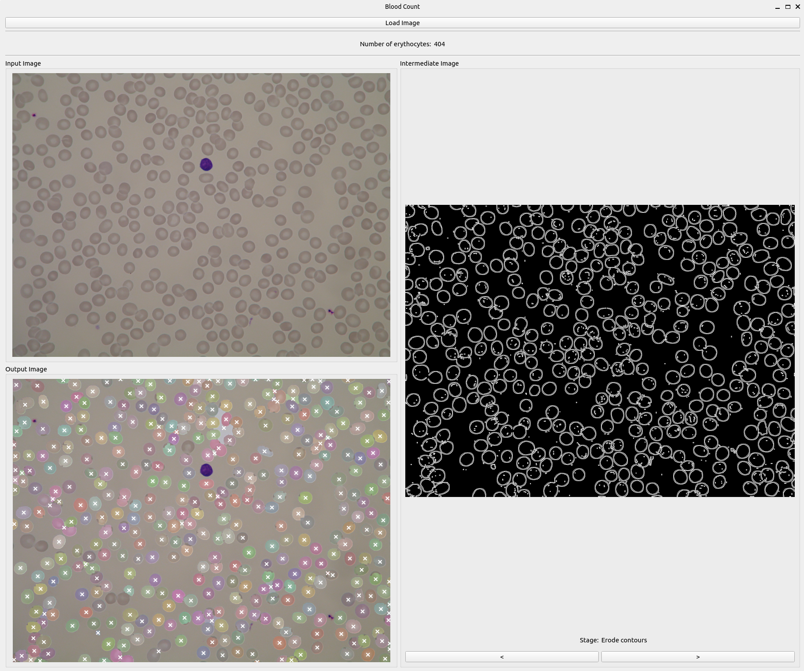
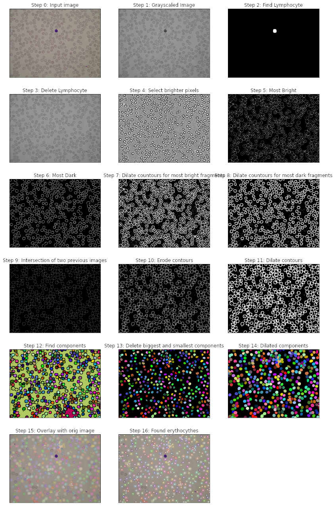

# Application for Counting Erythrocytes in Microscopic Blood Images

The application allows you to load an image to preview intermediate steps of handmade algorithm for erythrocyte detection
and count the number of erythrocytes.

The program was tested with [ALL_IDB1 dataset](http://homes.di.unimi.it/scotti/all/) which is a free dataset of microscopic images of blood samples, specifically designed for the evaluation and the comparison of algorithms for segmentation and image classification.

## Requirements
The program was implemented in Python 3, using the PyQt5 graphics library for UI and opencv & numpy for image processing and cell counting. Requirements are defined in `requirements.txt`.

## Launching
To run the program, setup your environment and run `python3 src/main.py`.

## UI preview

## Cell counting algorithm
The algorithm for cell counting & segmentation is handmade and consists of multiple steps, e.g. to remove lymphocytes, find cell outlines, extract components, remove outliers cells, etc. Below image shows exact steps and resulted images. For details refer to `src/cell_count.py`.

